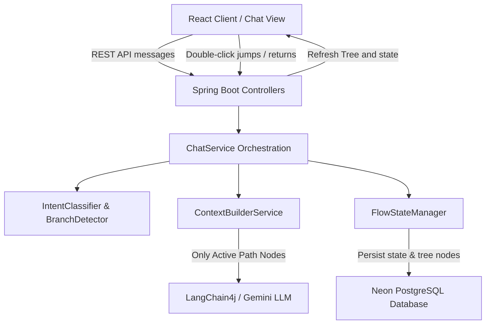

# TinexusFlow™ Architecture Documentation

TinexusFlow is an advanced Conversation Navigation Engine that structures human-AI interactions as tree topologies rather than simple linear lists of messages. This document outlines the technical design, data flows, and algorithms of TinexusFlow.

---

## 1. System Topology Overview

The application is built on a split-panel interface: a modern React frontend utilizing **Zustand** for state synchronization and **React Flow** for tree visualization, communicating with a **Spring Boot 3.5+** REST API.



---

## 2. Core Modules

### 2.1 The TinexusFlow Core Engine
- **NodeEngine:** Handles entity mutations and structural validations (such as verifying that root nodes lack parents and non-root nodes contain parent IDs).
- **BranchEngine:** Assigns materialized paths (e.g. `/` for root, `/rootId` for depth 1, and `/rootId/depth1Id` for depth 2) to maintain tree structure.
- **PathEngine:** Traverses materialized path tokens to build list-ordered ancestors and descendants without expensive database self-join recursions.
- **ReturnEngine:** Controls cursor resets. When a user backtracks, it updates the `FlowState` active pointer, records the pre-rollback cursor as `lastVisitedNodeId`, and updates the context path.

### 2.2 The TinexusFlow Intelligence Layer
- **IntentClassifier:** Determines user message semantics:
  - `RETURN_PARENT` / `RETURN_ROOT`: navigation requests.
  - `NEW_TOPIC`: resets conversation context.
  - `CLARIFICATION` / `CONTINUE_CURRENT`: standard chat queries.
- **BranchDetector:** Resolves whether a conversational reply triggers a sub-branch (drill-down clarification), continuation (current node addition), or a sibling topic.
- **AmbiguityResolver:** Detects if generic words like "continue" are ambiguous. If a user navigates up the tree and then commands "continue", they may want to jump back to their deep leaf node (`lastVisitedNodeId`) or start a new branch from their current position.
- **ContextResolver:** Interfaces with the `PathEngine` to supply active nodes to the context builder.

---

## 3. Context Construction Pipeline

The defining feature of TinexusFlow is selective context window management. Instead of sending the full tree, only the active path is included.

```
[ROOT Node] Q: What is AI? -> A: AI is...
  └── [Node 2] Q: Tell me about LLMs -> A: Large Language Models are... (ACTIVE CURRENT NODE)
  └── [Node 3] Q: What are computer vision systems? -> A: Computer vision... (IGNORED BRANCH)
```

The LLM prompt constructed by `ContextBuilderService` ignores the unrelated "Computer vision" sibling branch completely, keeping the model focused on the active path details.

---

## 4. API Specification

- `POST /api/chat/message`: Main message dispatcher. Returns node, state, and ambiguity status.
- `POST /api/flow/branch`: Manually spawns a clarification branch.
- `POST /api/flow/return-parent`: Sets active cursor to parent.
- `POST /api/flow/return-root`: Resets active cursor to root.
- `POST /api/flow/navigate`: Jumps cursor to any selected node ID.
- `GET /api/flow/tree/{conversationId}`: Retrieves full node list and state.
- `GET /api/flow/path/{conversationId}`: Retrieves active path nodes in chronological order.
